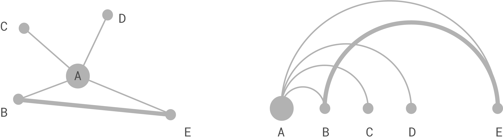

is a type of one-dimensional diagram showing connections between any two nodes out of multiple nodes positioned on a single axis.[^wattenberg] 

<!--more-->

An arc diagram consists of ***nodes***, ***arcs***, and one ***axis***. ***Node distance*** along the X-axis is either equal or weighted, for example, representing the time elapsed.[^nagel]
The order in which nodes appear on the axis is called *node seriation*.[^heer] Node seriation can be already present in sorted data ordered by time or distance. 

The purpose of an arc diagram is in revealing the connections between a set of values and the clusters that they might form.

In practice, arc diagrams do not show all possible connected pairs because of the resulting clutter, but rather it shows a subset of connections.

Arcs can have a direction and a weight with directional arcs being either uni- or bi-directional. Arc weight shows the strength of a connection between two nodes. Weighted arcs tend to reveal clusters of connections between nearby nodes. The arcs typically face upward, but they can also appear on both sides of the axis.  The number of arc connections that come out of a single node appears as a bubble sized proportionally to the total number of links coming in and going out.[^sanchez]

An arc diagram is a type of [network diagram](/network-diagram).[^wattenberg2] Any network diagram, which is a two-dimensional chart, can be represented as an arc diagram, which is a one-dimensional chart.

Arc diagrams are less useful for revealing clusters than network diagrams. Still, it is possible to order the nodes in a way that reveals clusters.

Arc connections typically use semi-circles or bezier curves, the latter being more space-saving. Color and transparency can encode an additional layer of data.

Arc diagrams can combine with other charts, for example, a [bar chart](/bar-chart) or a [bubble chart ](/bubble-chart) in which each bar or circle is proportional to the number of connections in a node.

In 1964, mathematician Thomas Saaty proposed the first version of the arc diagram to show intersecting numbers.[^saaty] In 2001, the arc diagram was popularized by Martin Wattenberg who diagrammed songs in his project *The Shape of Song*.[^wattenberg3]

## Alternatives
1. [*Hive plot*](/hive-plot) are essentially arc diagrams with multiple axes. When there is a need to display connections between different categories of nodes, the hive plot can be an alternative to constructing multiple arc diagrams.

2. [*Network diagram*](/network-diagram) is functionally the same as an arc diagram, network diagrams use two-dimensional space, which makes them easier to read as long as they are uncluttered.

## Further reading
1. [Arc diagram](https://en.wikipedia.org/wiki/Arc_diagram) article on Wikipedia.

## References
[^wattenberg]: Wattenberg, Martin. ["Visual exploration of multivariate graphs."](http://hint.fm/papers/pivotgraph.pdf) *Proceedings of the SIGCHI conference on Human Factors in computing systems*. ACM, 2006.
[^nagel]: Nagel, Till, and Erik Duval. ["A visual survey of arc diagrams."](https://uclab.fh-potsdam.de/wp/wp-content/uploads/2013-a-visual-survey-of-arc-diagrams.pdf) *IEEE Visualization*. 2013.
[^heer]: Heer, Jeffrey, Michael Bostock, and Vadim Ogievetsky. ["A tour through the visualization zoo."](https://queue.acm.org/detail.cfm?searchterm=Mind+Maps&id=1805128) *Commun. Acm 53.6* (2010): 59-67.
[^sanchez]: ["Arc Diagrams in R: Les Miserables" by Gaston Sanchez](http://www.gastonsanchez.com/visually-enforced/got-plot/how-to/2013/02/02/Arc-Diagrams-in-R-Les-Miserables/)
[^wattenberg2]: Wattenberg, Martin. ["Arc diagrams: Visualizing structure in strings."](http://ieg.ifs.tuwien.ac.at/~aigner/teaching/ws06/infovis_ue/papers/arcdiagram_01173155.pdf) *IEEE Symposium on Information Visualization, 2002. INFOVIS 2002*. IEEE, 2002.
[^saaty]: Saaty, Thomas L. ["The minimum number of intersections in complete graphs."](https://www.pnas.org/content/52/3/688) *Proceedings of the National Academy of Sciences of the United States of America* 52.3 (1964): 688.
[^wattenberg3]: ["The Shape of Song" by Martin Wattenburg"](http://turbulence.org/Works/song/gallery/gallery.html)
