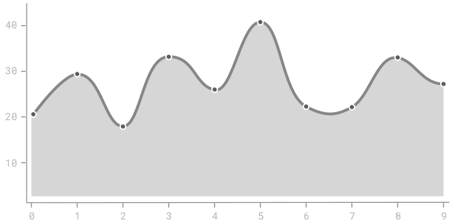

displays data as the area between the data curve and the horizontal axis. [^wilkinson] Area charts emphasize the change of a single variable by connecting individual data points. 

<!--more-->
The purpose of an area chart is visualizing the change of a single variable. Functionally, area charts are the same as [line charts](/line-chart). Visually, using the area instead of a line makes the shape of the data more noticeable. Especially for multi-line charts and stacked or grouped area charts the filled area below the data curve improves the chart's readability. 

Even though an area chart consists of individual data points, its purpose is not in communicating a set of specific values but in showing their relationships. For this reason, the data points typically do not have labels.

The X-axis has a numeric or a categorical scale. The Y-axis is usually categorical. Dot markers typically indicate individual data points when few of them appear in the chart.

The primary use cases of area charts are indicating trends, comparing trends, their changes, and relationships between values. Color and texture can emphasize these relationships. [^harris]

Like [bar charts](/bar-chart), area charts emphasize change and trends. But an area chart can display more data points in the same space. 

Area charts can have three types of data curves depending on their data aggregation method: segmented, stepped, and smoothed.

William Playfair introduced area charts in 1786 in his book *The Commercial and Political Atlas*.

## Variations

### Stacked area chart
  Stacked area chart shows multiple data curves and fills the area between them. The curve with less variation is typically drawn at the bottom, closer to the X-axis. Stacked area charts are known to be difficult to perceive because the human eye does not judge area shown relative to a curved line as well as relative to a straight line.[^thud] The fill in a stacked area chart is necessary for readability. [^koponen]

### Range area chart
  A range area chart is a variation of the area chart that shows two data curves to define a range in between. The area below the lower data curve typically has no fill to emphasize the range inside the space created by the two curves.

### Spline area chart
  Also called *spline area graph*, the spline area chart connects individual data points with a smooth curve, unlike the segmented area chart that draws a straight line.  Additional data points are necessary to draw the smooth spline curve.  They come from a spline interpolation function that estimates the values between the known data points.

### Stepped area chart
 Also called *stepped area graph*, the stepped area chart resembles steps because the data it describes has abrupt changes of value. The stepped area chart is functionally identical to [stepped line chart](/line-chart).

### Radial area chart
A radial area chart is an area chart plotted in polar coordinates. Even though it is visually similar to the [radar chart](/radar-chart), its function is different. The radar chart's radial axes each represent a different variable, while a radial area chart plots the same variable on the X-axis curving around a central point.  Radial charts are useful for showing cyclical data, for example, seasonal weather patterns.  

## Alternatives

1. [*Bar chart*](/line-chart) displays the relationship of a category to a numeric variable as the height a rectangle bar.

2. [*Line chart*](/line-chart), functionally the same as an area chart, a line chart is more suitable for cases where multiple line charts are displayed in the same graph space.

3. [*Streamgraph*](/stream-graph) is a type of stacked area chart aligned relative to central axis. Streamgraphs have a smoothed curve. They are normally oriented horizontally.

## Sources

[^wilkinson]:  Wilkinson, Leland. ["The grammar of graphics."](https://books.google.com/books?id=ZiwLCAAAQBAJ) Handbook of Computational Statistics. Springer, Berlin, Heidelberg, 2012. 375-414.
[^harris]: Harris, Robert L. [Information graphics: A comprehensive illustrated reference.](https://books.google.com/books?hl=en&lr=&id=qusmDAAAQBAJ) Oxford University Press, 2000. p. 10
[^thud]: Thudt, Alice, et al. ["Assessing the Readability of Stacked Graphs."](https://dx.doi.org/10.20380/GI2016.21) 2016. [PDF](https://hal.inria.fr/hal-01587962/document)
[^koponen]: Koponen, Juuso, and Jonatan Hildén. [Data visualization handbook.](https://shop.aalto.fi/p/971-data-visualization-handbook/) Aalto korkeakoulusäätiö, 2019 p. 210 
