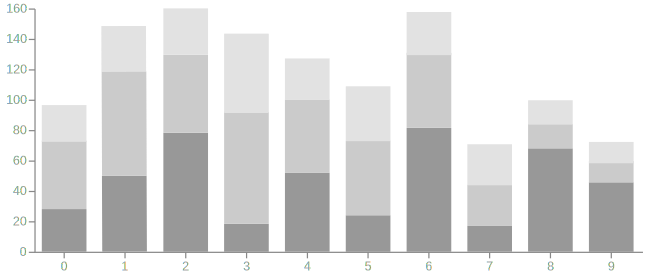

displays the relationship of a *category* to a *numeric variable* in the form of a rectangle bar. The bar height along the Y-axis or its length along the X-axis represents a number.  Each bar represents only one number. For this reason, bar charts can be used to compare *discrete* numbers and not continuously changing numbers.[^harris]

<!--more-->

Bar charts are often used to compare the change of value over time or across categories. This broad application explains the popularity of the bar chart. 

The baseline of a bar chart should always start at zero. Otherwise, the bar length will not be interpreted correctly by the reader. [^yau] While there are not many rules about chart design, this particular one is. A bar chart with the Y-axis not starting at zero can never represent its data truthfully, and so it defeats the purpose of the chart.

The bar width is equal and cannot be used to represent data. Using the width of the bar would turn the bar chart into a [Marimekko Chart](/marimekko-chart). The distance between bars is also equal and not indicative of data values. Bars can be ordered or unordered.

William Playfair introduced the bar chart in 1786. Although not popular initially, it has since become the default choice of a chart because of its graphic simplicity and familiarity. However, data journalism and information graphics fields found alternatives to and created variations of the bar chart.  *The New York Times* graphics editor Amanda Cox says, "There's a strand of the data viz world that argues that everything could be a bar chart. That's possibly true but also possibly a world without joy." [^beniato]

Functionally, a bar chart is not suitable for show distribution, median or mean, ratios, correlation, relationships or connections, or anything more than a single data point per category. 

## Variations
Bars in a chart can be grouped and stacked to show more groups of categories. Triangles and other figures can substitute the bar shape. However, shapes other than the rectangle are more difficult for the eye to interpret.

### Grouped bar chart
 Grouped bar charts show two or more data series with their respective bars displayed side by side. This type of chart can also be called a *clustered bar chart* or a *multiple bar chart*. In all variations, bars must have the same width since the chart can only show values through the height of the bars, not the area or the width.

### Stacked bar chart
 A Stacked bar chart shows two or more data series where each respective bar stacks on top of another along the vertical axis.  In practice, the number of data series is limited. The stacking order of all data series has to be the same order across all the bars.

### Tornado chart
 The tornado chart, also known as *tornado diagram*, is a horizontal bar chart with bars ordered from the longest at the top to the shortest at the bottom, creating a funnel-like shape. Tornado charts are useful for situations where the descending ordering of the bars points to an insight.

### Span chart
 Span chart (also known as *range bar chart*, *range column chart*, *floating bar chart*/bar graph) is ...

### Lollipop chart
 Lollipop chart (also known as *lollipop plot*) replaces a bar with a line and a dot at the far end. Lollipop charts may be useful in large data sets where bars would be too thin.

### Dumbbell chart
 Dumbbell chart (also known as *Dumbbell plot*, *Connected dot plot*) is a variation of lollipop chart...

### Circular bar chart
Circular bar chart positions the bars along a rounded X axis. Rounded charts are known to be harder to interpret for the human eye than the linear variation.[^thudt]
 

### Radial bar chart
Radial bar chart (also known as *radial column chart*, *polar bar chart*)...

### Spiral bar chart
 Spiral bar chart (also known as *spiral column chart*) ...

## Alternatives
With the bar chart being the ubiquitous default, there is often a need to find an alternative. 

1. *Dot chart* uses a dot to represent a data point and otherwise works the same way as a bar chart. Dot plots allow for a more elegant way of displaying large data sets.[^robbins] This dot chart is not to be confused with the [dot plot](/dot-plot), a statistical graphic that shows the distribution of individual observations represented as dots at regular intervals. It is similar to the [histogram](/histogram), but it is more accurate since the data is not binned.
2. [*Isotype diagram*](/isotype-diagram) uses icons to represent a data point as the total length of the row of icons. Isotype chart can help a reader see the semantic meaning of each category in the chart. [^haroz]
3. [*Waterfall chart*](/waterfall-chart) is an alternative to a stacked bar chart. It tracks the change from an initial value through a series of intermediate values to the end value. The first column is the initial value. The last column is a cumulative total.
4. [*Bullet chart*](/bullet-chart) functionally the same as a bar chart, the bullet chart adds a symbol for the target value and a progress bar.
5. *Slope graph* is an alternative to a stacked bar chart. A slope graph shows the relationship between two sets of categories.

It is worth noting that the pie chart and the bubble, both of which are other popular charts, are not functional alternatives to a bar chart.

## References
[^harris]: [Information Graphics: A Comprehensive Reference by Robert L. Harris](https://books.google.com/books?id=LT1RXREvkGIC)
[^berinato]: ["The Power of Visualization's "Aha!" Moments" by Scott Berinato, Harvard Business Review, retrieved Apr 3, 2019](https://hbr.org/2013/03/power-of-visualizations-aha-moment)
[^yau]: [FlowingData.com by Nathan Yau, retrieved Apr 3, 2019](https://flowingdata.com/2015/08/31/bar-chart-baselines-start-at-zero/)
[^thudt]: [Assessing the Readability of Stacked Graphs by Alice Thudt, et al. ](https://hal.inria.fr/hal-01587962/document)
[^robbins]: [Dot Plots: A Useful Alternative to Bar Charts by Naomi B. Robbins, p.3](http://perceptualedge.com/articles/b-eye/dot_plots.pdf)
[^knaflic]: [Storytelling with Data: A Data Visualization Guide for Business Professionals by Cole Nussbaumer Knaflic, pp.55-56](https://books.google.com/books?id=IheRCgAAQBAJ&printsec=frontcover&dq=alternative+to+%22bar+graph%22&hl=en&sa=X&ved=0ahUKEwib7qDuyrbhAhUlGKYKHWDxAqAQ6AEILzAB#v=onepage&q=bar%20chart&f=false)
[^haroz]: [ISOTYPE Visualization – Working Memory, Performance, and Engagement with Pictographs, p.1](http://steveharoz.com/research/isotype/ISOTYPE_Visualization_CHI2015_Haroz_Kosara_Franconeri.pdf)
