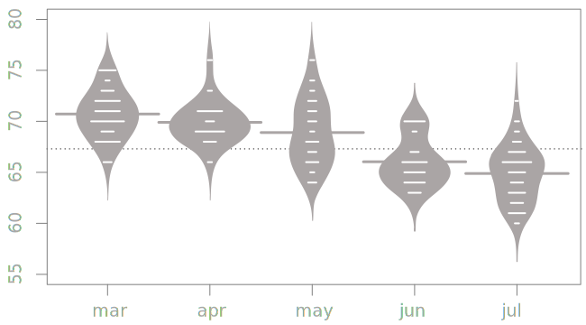
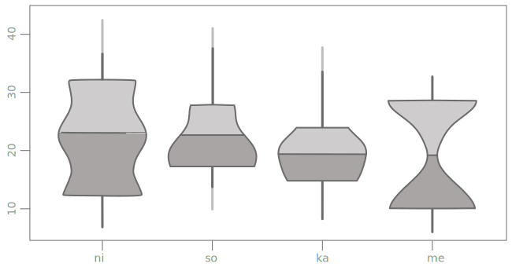
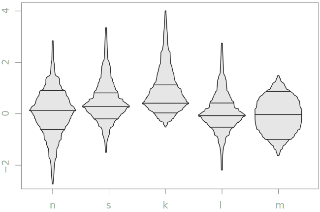
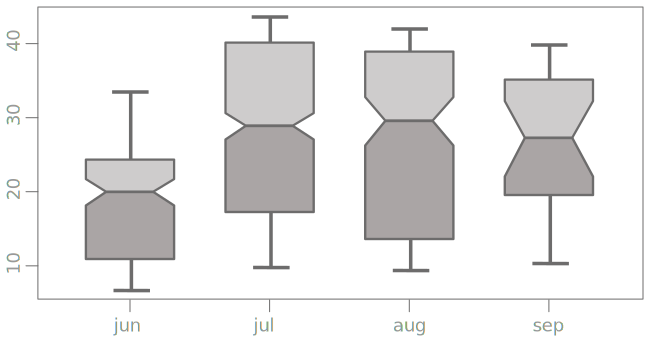
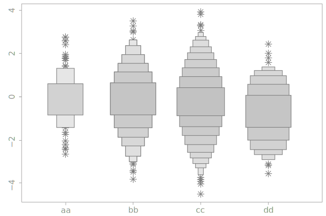
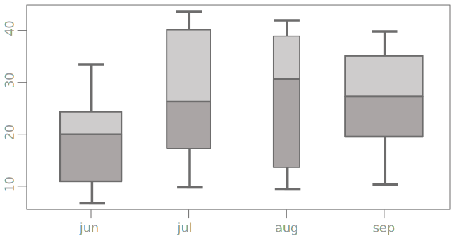
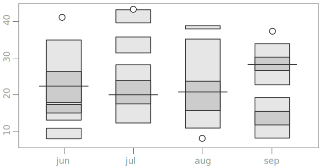

shows a summary of data distribution, including the minimum, maximum, upper and lower quartiles, and the median.

<!--more--> 
The main function of a box plot is a generalized comparison of distributions. 

A single box plot displays a summary of data distribution by showing the median, the upper and lower quartiles, the maximum and minimum, and the outliers.[^potter] Since box plots only show a summary of distribution, they do not show the actual shape of distribution as, for example, a [histogram](/histogram) does.
 
Box plots are best fit for comparing minimums, maximums, and the medians across multiple data series.

Box plots are shown on the X, Y-axes, where the X-axis can be categorical or numeric. The Y-axis is numeric. The combination of the box and whiskers represents the distribution of all data points except the outliers. The box shows the two quartiles in the middle, also called the interquartile range. The middle line is the median, which is the value separating the upper and lower halves of the data. The dots outside the whiskers represent the outliers.

Tick marks on both axes help a reader locate the corresponding values since box plots tend to be visually complex.

The box plot was introduced in 1970 by John Tukey [^wickham] who also invented the term "bit." [^billinger]

## Variations

### Beanplot 
 Bean plots show individual observations as lines while showing the distribution as area, similar to a density plot.[^kampstra]

### Vase plot 
 Vase plots add estimated densities for every point between the upper and lower quartiles to the histplot. 

### Box-percentile plot
 Box-percentile plots use both sides of the box plot to show the distribution at each point. For each point in the plot, the box width is proportional to the percentile of that data value, up to 50th percentile. After that, it switches to being proportional to values outside the percentile. The plot is symmetrical. The upper quartile, median, and lower quartile are marked with a line. Similarly to a violin plot, the advantages of this plot is that it covers the entire range of data.

### Notched box plot
 Notched box plot displays confidence intervals around the medians, supporting visual assessment of statistical significance.
<!-- @anna rewrite this, copy-paste -->

### Letter-value box plot
 Letter-value box plot was designed to overcome the shortcomings of the boxplot for large data...
<!-- @anna rewrite this, adding this paper http://vita.had.co.nz/papers/letter-value-plot.pdf -->

### Variable width box plot
 Uses the width of the box to represent ...
<!-- @anna rewrite this -->

### HDR box plot
 HDR Box Plot, or the *highest density region* (HDR) boxplot (Hyndman, 1996) is a compromise between a boxplot and a density boxplot.
<!-- @anna rewrite this, copy-pasted from paper -->

## Alternatives
Charts that show distributions are all potential alternatives to a box plot. With few data series, using a histogram of a density plot may be possible, otherwise, to compare multiple data sets, the violin plot or the beeswarm plot are better.

1. [*Histogram*](/histogram) shows an estimate of the probability distribution of a continuous variable using discrete values.

2. [*Violin plot*](/violin-plot) displays the density for all data points, not just the middle half.

3. [*Scatter plot*](/scatter-plot) shows distribution by plotting every data point on the X, Y coordinates. The overall shape, as well as individual data points, are better displayed on a scatter plot because the box plot only summarizes the distribution.

4. [*Beeswarm Plot*](/scatter-plot/#beeswarm-plot) is a one-dimensional scatter plot with closely-packed points that do not overlap[^tud].

## Sources
[^wickham]: [40 Years of Boxplots](http://vita.had.co.nz/papers/boxplots.pdf)
[^billinger]: [John Wilder Tukey by David R. Brillinger, p.200](https://www.ams.org/notices/200202/fea-tukey.pdf)
[^potter]: [Methods for Presenting Statistical Information: The Box Plot, p 97](http://www.sci.utah.edu/~kpotter/publications/potter-2006-MPSI.pdf)
[^potter2]: [Methods for Presenting Statistical Information: The Box Plot by Kristin Potter p. 100](http://www.sci.utah.edu/~kpotter/publications/potter-2006-MPSI.pdf)
[^kampstra]: [Beanplot: A Boxplot Alternative for Visual Comparison of Distributions by Peter Kampstra, p. 4](https://cran.r-project.org/web/packages/beanplot/vignettes/beanplot.pdf)
[^tud]: [R package by Aron Charles Eklund, Ph.D., Technical University of Denmark, retrieved Apr. 8, 2019](http://www.cbs.dtu.dk/~eklund/beeswarm/)
