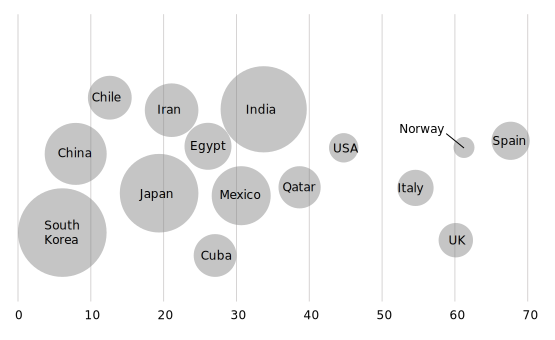
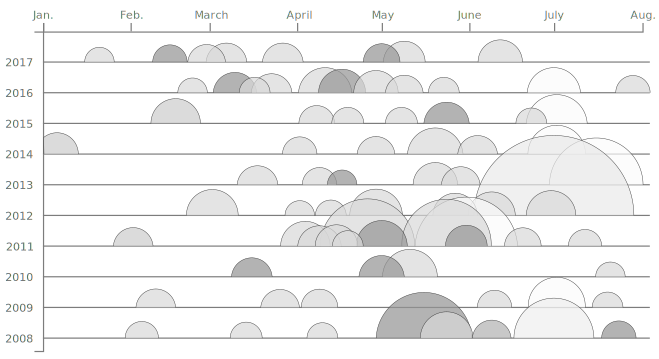
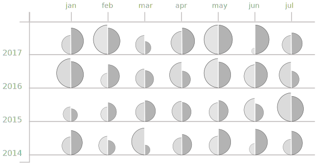

is a type of [scatter plot](/scatter-plot) that displays three variables by using circles of varying size and their positions on the X and Y-axes. 

<!--more-->

The bubble chart displays the ***independent variable*** on the X-axis and the ***dependent variable*** on the Y-axis. A third variable is represented as ***scaled circles*** where the circle area represents the value. Importantly, it is always the circle area, not diameter or radius. Since the human eye cannot easily estimate the size of a circle, bubble charts are not suitable for communicating exact values.[^cleveland]
The bubble size should not be used to represent the independent or the dependent variable, it can only encode secondary information. [^koponen]

It is possible to show more than three variables by color-coding circle groups and by animating the bubble chart. [^magnuson] Clusters, outliers, and overall trends reveal themselves well on a bubble chart. However, bubble charts are easy to over-plot, reducing the readability.

The advantage of bubble charts is their ability to show trends in large data sets. Similar to a [scatter plot](/scatter-plot), the bubble chart makes the distribution shape and the outliers evident.

A disadvantage of the bubble chart is its lack of means for representing negative values and zero. Like scatter plots, they can become cluttered, in which case data can be grouped with each bubble representing an equal number of data points.

The [first bubble chart](https://en.wikipedia.org/wiki/Pie_chart#/media/File:Playfair_piecharts.jpg) appeared in William Playfair's <cite>Commercial and Political Atlas</cite> published in 1786.  Swedish statistician Hans Rosling famously used an animated bubble chart to explain [macro trends in world population](https://youtu.be/FACK2knC08E?t=452).

## Variations

### One-Dimensional Bubble Chart
 The One-Dimensional Bubble chart uses only one axis and the scaled circles to represent two variables. Without one of the axes it loses the properties of a scatter plot that allow it to show correlations. Functionally, this type of bubble chart is more similar to a [beeswarm plot](/strip-plot#beeswarm-plot). The scaled circles are usually displayed using a force-directed layout, which is a visual arrangement that avoids any overlap of circles while changing the circle position. This positioning can shift the circles from their positions on the axis which makes this chart prone to misrepresentation.

### Semi-circle plot
 Since bubble charts with a lot of data points tend to become cluttered with overlapping circles, to [de-clutter a bubble chart](https://flowingdata.com/2017/10/26/how-to-make-a-semicircle-plot-in-r/), it is possible to show only half of each circle as shown in [this example from the New York Times](https://www.nytimes.com/interactive/2017/09/01/upshot/cost-of-hurricane-harvey-only-one-storm-comes-close.html?smid=tw-share&_r=0). This chart presumes that the entire circle area is perceived by the reader from seeing its half. This idea is similar to the bands that partially conceal time series graphs in a [horizon plot](/joy-plot#horizon-plot).

### Double semi-circle plot
 The double semi-circles allow comparison between two related numbers [displays two half-circles side by side](https://www.informationisbeautifulawards.com/showcase/604-the-analytical-tourism-map-of-piedmont) with the area of each circle being inferred from its half. Although semi-circles may be more difficult to compare visually, this variation increases the data density becoming a space-saving bubble chart variety. A similar technique is used in the [split violin plot](/violin-plot#split-violin-plot).

## Alternatives

1. [*Marimekko chart*](/marimekko-chart) shows categorical data as rectangles with their widths and lengths proportional to quantities and categories represented as columns. 

2. [*Scatter plot*](/scatter-plot) showing the distribution of two variables represented as dots along the horizontal and vertical axes. The dots can use color or shape to represent an additional variable.

2. [*Proportional area chart*](/proportional-area-chart) a type of one-dimensional chart that uses area of a shape to visualize a single variable without the use of axes. With few data points, a bubble chart can potentially be represented as one or a series of proportional area charts.

## Sources
[^cleveland]: Cleveland, William S., and Robert McGill. ["Graphical perception and graphical methods for analyzing scientific data."](http://snoid.sv.vt.edu/~npolys/projects/safas/1695272.pdf) Science 229.4716 (1985): 828-833. 
[^koponen]: Koponen, Juuso, and Jonatan Hildén. [Data visualization handbook.](https://shop.aalto.fi/p/971-data-visualization-handbook/) Aalto korkeakoulusäätiö, 2019. p. 193
[^magnuson]: Magnuson, Lauren, ed. [Data visualization: a guide to visual storytelling for libraries.](https://books.google.com/books?id=wxrMDAAAQBAJ) Rowman & Littlefield, 2016. 

