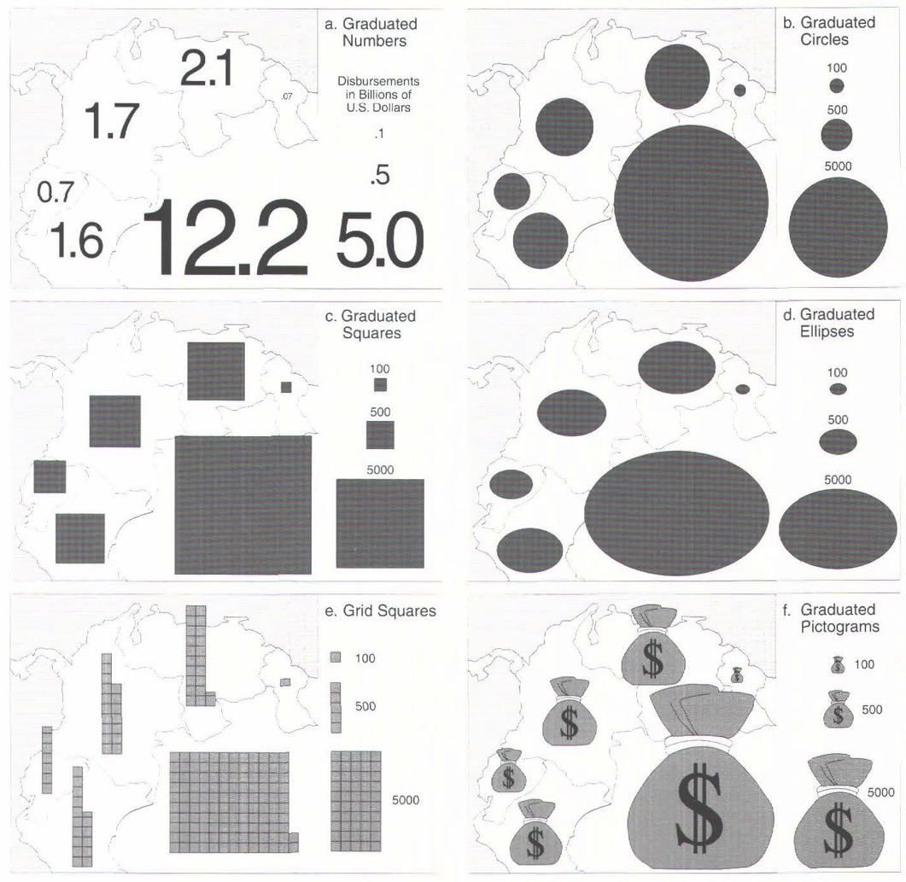
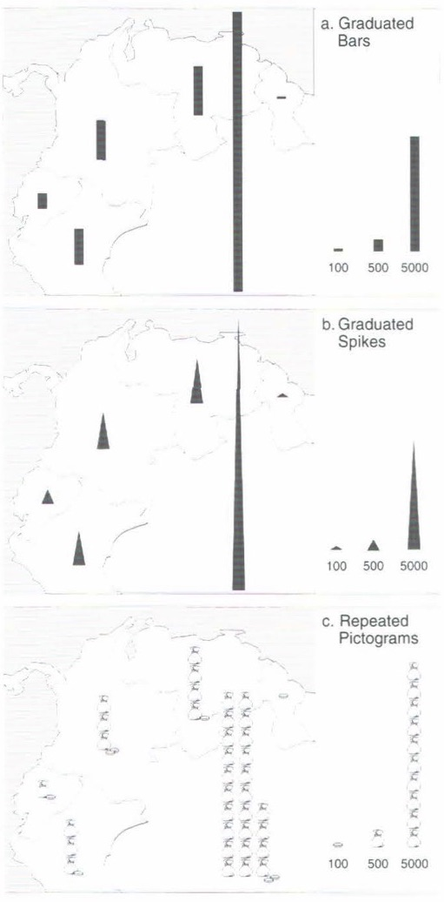

visualizes numeric data using scaled symbols positioned in locations to which they refer. The underlying map is divided into regions, with a single symbol displayed per region.
 The symbols, typically circles, are sized based on their area, not diameter or radius. 
<!--more-->

Proportional symbol maps are used to compare data among geographic regions. The comparison is between data values, percentages, or ratios. The ***symbol*** is typically a circle, however, other types of shapes can be used when a reader needs to see values more precisely. Scaled squares and vertically stacked rectangles similar to a [tape diagram](/tape-diagram) are more effective in communicating precise values than circles. [^brewer]

One of the challenges in creating a proportional symbol map is the choice of symbol scaling. There are three types of ***scale***: mathematical scaling, perceptual scaling, and range grading. [^cabello]

*Mathematical scaling* reflects the data as it is. Even though this is the most accurate scaling, the human eye is known to misjudge the relative areas of shapes, especially circles and irregular shapes. To compensate for this, *perceptual scaling*, also called *apparent value scaling*, sizes the larger symbols on a map even larger.
*Range grading* groups data into classes and represents each class with a single symbol. The need for range grading comes from the nature of maps themselves-some regions are larger than others, and yet each region is represented by a single symbol. Following a symbol-per-region logic can lead to misleading representations of data. [^cairo]

A ***legend*** that contains three sizes of symbols - small, medium, and large - is recommended as a way of helping a reader to estimate the size of the symbols correctly.[^cox]

### How to Choose the Right Symbol?
Multiple scientific studies have attempted to find the symbol shape that is most intuitive for the human eye to interpret.
Rectangular symbols were found to be more intuitive than circle-based ones.[^crawford] Scaled bars representing data as their lengths and not areas, produced even better perception results than squares.
An exception to this rule are symbols showing percentage relationships -- readers see 25%, 50%, and 75% better when they look at wedges of a circle than parts of a bar.[^eells]

The choice of proportional symbols is usually between abstract geometric shapes and pictographs. Geometric shapes reveal their size better, while pictographs are more intuitive to remember for their context.  [^montello]

Symbols need to be scaled appropriately to avoid clutter. Ideally, symbols should not overlap. Symbols have to avoid obstructing the underlying map, which can be achieved with partially transparent symbols.

<!-- TODO: redraw types of symbols as svg. From 'Beyond Graduated Circles: Varied Point Symbols for Representing Quantitative Data on Maps' by Cynthia A. Brewer, p.14 -->

## Alternatives

1. [*Choropleth map*](/choropleth-map) uses colored areas to represent the measurement of a variable proportional to the colored area.

2. [*Cartogram*](/cartogram) substitutes land area with time, population or any other variable, distorting the geometry of the map. There are three ways in which the map can be distorted: 1. by bulging out the areas; 2. by splitting map features; 3. by representing each map feature as a simple geometric shape such as a circle.

3. [*Dot Distribution Map*](/dot-distribution-map) uses a dot symbol to represent a data point showing the distribution of values through the scatter pattern similar to a scatter plot.

## Sources

[^brewer]: Brewer, Cynthia, and Andrew J. Campbell. ["Beyond graduated circles: varied point symbols for representing quantitative data on maps."](https://cartographicperspectives.org/index.php/journal/article/download/cp28-brewer-campbell/pdf/0) *Cartographic Perspectives* 29 (1998): 6-25, p.
[^cabello]: Cabello, Sergio, et al. ["Algorithmic aspects of proportional symbol maps."](https://link.springer.com/content/pdf/10.1007%2Fs00453-009-9281-8.pdf) *Algorithmica* 58.3 (2010): 543-565.
[^cairo]: Cairo, Alberto. [The Functional Art: An introduction to information graphics and visualization.](https://books.google.com/books?id=xwjhh6Wu-VUC) New Riders, 2012. p. 125.
[^cox]: Cox, Carleton W. ["Anchor effects and the estimation of graduated circles and squares."](https://www.tandfonline.com/doi/abs/10.1559/152304076784080195) *The American Cartographer* 3.1 (1976): 65-74.
[^crawford]: Crawford, Paul V. ["The perception of graduated squares as cartographic symbols."](https://www.tandfonline.com/doi/abs/10.1179/caj.1973.10.2.85?journalCode=ycaj20) *The Cartographic Journal* 10.2 (1973): 85-88.
[^eells]: Eells, Walter Crosby. ["The relative merits of circles and bars for representing component parts."](https://www.jstor.org/stable/2277140) *Journal of the American Statistical Association* 21.154 (1926): 119-132.
[^montello]: Montello, Daniel R. ["Cognitive map-design research in the twentieth century: Theoretical and empirical approaches."](https://geog.ucsb.edu/~montello/pubs/history.pdf) *Cartography and Geographic Information Science* 29.3 (2002): 283-304.
