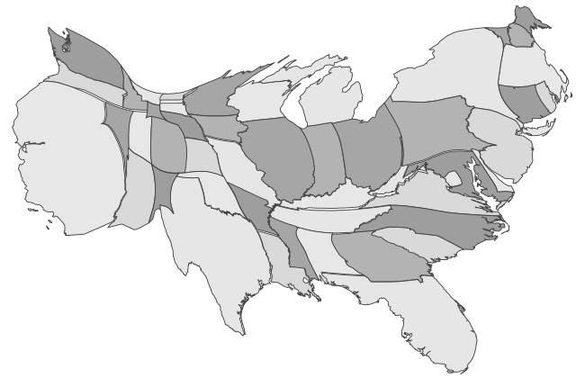
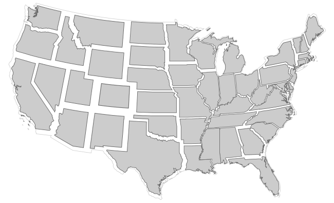
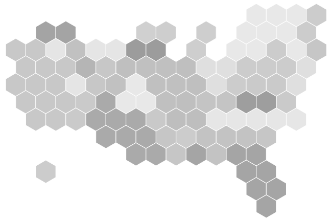

is a type of map that substitutes land area with time, population or any other variable, distorting the geometry of the map. The distortion usually happens by way of resizing the map regions according to a statistical parameter, but in a way that keeps the map recognizable.

<!--more-->
There are four types of cartograms based on the method of distortion: 
1. *Contiguous cartogram* also known as *deformation cartogram*  distorts areas by pulling or pushing the boundaries between regions. 
2. *Non-contiguous cartogram*  scales each region independently to an area that reflects a data point
3. *Dorling cartogram* display each region as a circle with its area representing a data point
4. *Rectangular cartogram* represent each region in the map with a rectangle area 

Preserving accuracy in a cartogram is a known challenge. It is not possible to create a perfect cartogram free of statistics and geographic errors, but it is possible to balance the three parameters of cartogram's accuracy:

1. Statistical accuracy - how accurately the distorted area represents the statistical data. It is measured in terms of "cartographic error."
2. Geographical accuracy - resemblance of distorted geographic areas to the cartogram shapes, including their positions relative to each other
3. Topological accuracy - resemblance of adjacent regions in the cartogram to the areas in the original map.

For human perception, Dorling cartograms demand more effort than non-contiguous cartograms. Reading contiguous cartograms also leads to fewer errors than for Dorling cartograms. [^nusrat]

Cartograms are criticized for misrepresenting geography, data, and the adjacency of regions in a map. [^nusr] Since cartograms assume reader familiarity with the original map, readers unfamiliar with the actual geography of a map may not be aware of a cartogram's distortion.   It is recommended to provide at least the points along the country outlines that are proven to be the visual cues for shape identification. [^rittschof] Another option is providing an inset map showing the actual geography. [^dent]

An advantage of a cartogram is its ability to show a reader an unusual view of the world or an area that is otherwise familiar.[^tyner3]
Another advantage of cartograms is that data does not need to be classified or range graded, as can be the case with [proportional symbols maps](/bubble-map).
 
Showing data that has little to do with the actual land area is often best done with a cartogram. Information designers have noticed that representing actual geography is not always an essential feature of a map. For example, it is difficult even to see densely-populated states like New York, while large states like Wyoming have few people living there. On a demographic map, Wyoming would look too large, and New York would appear unjustifiably small.

Cartograms became popular in 1934 when cartographer Erwin Raisz published the first statistical rectangular cartograms.[^tyner]

## Variations

### Contiguous Cartogram
 Also known as *density-equalizing cartogram*  or *deformation cartogram* is a cartogram with map features bulging to represent values. It distorts areas by pulling or pushing the boundaries between regions. 

### Non-Contiguous Cartogram
  This cartogram variation scales each region independently to an area that reflects a data point splitting regions from each other to emphasize the difference in size.

### Dorling Cartogram 
 Dorling cartograms display each region as a circle with its area representing a data pointare used to mimic the features of a map.
The circles do not reflect the true locations of regions relative to each other.

### Demers Cartogram
 A Demers cartogram is a sub-type of a Dorling cartogram, using squares instead of circles. 

### Mosaic Cartogram
 Also called *tile grid map* or *tile cartograms*, a mosaic cartogram represents each region as a group of rectangles that form a rectilinear polygon. These shapes allow for creating a shape more similar to the original area and preserving adjacency of regions.

### Hexbin map
 Also called a *hexagonal cartogram*, a hexbin map represents entire regions or their sub-divisions as adjacent hexagonal tiles. Hexagons have an advantage over rectangles and circles because they can show adjacency more accurately, having 6 six sides. The area of a hexagon is less evident to a reader than square area, but hexagons pack into shapes that more accurately approximate actual map region areas.

## Combinations
New cartogram variations are possible from combinations with other charts. For example, a Dorling cartogram with a mini-chart in place of each circle, following the principle of [small multiples](/small-multiples), becomes a new variation of more data-dense and multivariate cartogram. 

Some charts that can replace circles in a Dorling cartogram include [histogram](/histogram), [pie chart](/pie-chart), [proportional area diagram](/proportional-area-diagram), [area chart](/area-chart), [sparkline](sparkline), [Chernoff faces](/chernoff-faces), [line graph](/line-graph), [slopegraph](/slopegraph).

## Alternatives
1. [*Choropleth map*](/choropleth-map) uses colored areas to represent the measurement of a variable proportional to a colored area.

2. [*Bubble map*](/bubble-map) represents data as scaled symbols overlapping a map without distorting the map features.

3. [*Dot Distribution Map*](/dot-distribution-map) uses a dot symbol to represent a data point showing the distribution of values through the scatter pattern similar to a scatter plot.

## Sources
[^nusrat]: Nusrat, Sabrina, Md Jawaherul Alam, and Stephen Kobourov. ["Evaluating cartogram effectiveness."](https://arxiv.org/pdf/1504.02218.pdf) IEEE transactions on visualization and computer graphics 24.2 (2018): 1077-1090.

[^nusr]: Nusrat, Sabrina, and Stephen Kobourov. ["The state of the art in cartograms."](https://www2.cs.arizona.edu/~kobourov/star.pdf) Computer Graphics Forum. Vol. 35. No. 3. 2016.

[^tyner3]: ["Introduction to thematic cartography" by Judith A. Tyner, 1992, Englewood Cliffs: Prentice Hall](https://www.amazon.com/Introduction-Thematic-Cartography-Judith-Tyner/dp/0134891058)

[^tyner]: ["Principles of Map Design" by Judith A. Tyner, p. 189](https://books.google.com/books?id=385ti0DxibcC&pg=PA199&lpg=PA199&dq=A+Note+on+the+Importance+of+Shape+in+Cartogram+Communication&source=bl&ots=IDB-ahjOLF&sig=ACfU3U1i5NTS7ns7NWY9Ix9EjSW0NKrxpg&hl=en&sa=X&ved=2ahUKEwiNkvHn7sfhAhW0AWMBHcWhAYEQ6AEwBXoECAgQAQ#v=onepage&q=cartogram&f=false)

[^rittschof]: ["The Use of Cartograms in Visualizing Data Associated with Familiar and Unfamiliar Areas" by Kent A. Rittschof et al." 1995](https://archive.org/details/ERIC_ED384624/page/n3)

[^dent]: Dent, Borden D. ["Communication aspects of value-by-area cartograms."](https://www.tandfonline.com/doi/abs/10.1559/152304075784313278) The American Cartographer 2.2 (1975): 154-168.

