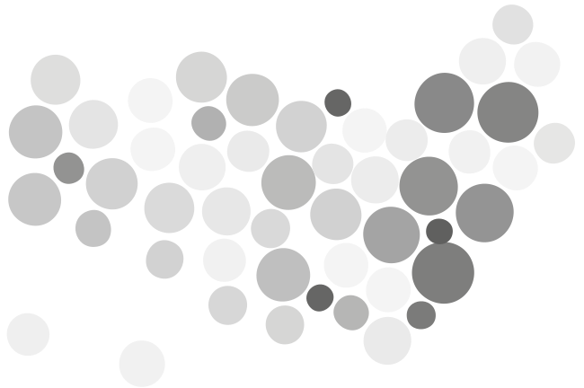

is a type of map that substitutes land area with time, population or any other variable, distorting the geometry of the map. The distortion usually happens by way of resizing the map regions according to a statistical parameter, but in a way that keeps the map recognizable.

<!--more-->
There are three ways in which the map can be distorted: 
1. bulging out areas (density-equalizing cartogram);
2. splitting map features (non-contiguous cartogram);
3. representing each map feature as a simple geometric shape such as a circle.

Cartograms became popular in 1934 when cartographer Erwin Raisz published the first statistical rectangular cartograms.[^tyner]

The main advantage of a cartogram is its ability to grab a reader's attention and show an unusual view of the world or an area that are otherwise familiar.[^tyner2]

Another advantage of cartograms is that data does not need to be classified or range graded, as is the case with [proportional symbols maps](/bubble-map).
 
Information designers have noticed that representing true geography is not always the most important feature of a map. For example, on the map of the United States, it is difficult to even see densely-populated states like New York, while large states like Wyoming have few people living there.
Showing data that has little to do with the actual land area is often best done with a cartogram.  

The main caveat with cartograms is that the readers have to be familiar with the map of an area so that even when distorted it is still recognizable. For this, provide at least those points along the country outlines that are proven to be the visual cues for shape identification.[^rittschof]

<!-- @anna [Q] should we add combining tile grid cartogram with other graphs like pie chart, area, waffle chart (as shown here http://datavizcatalogue.com/blog/chart-combinations-tile-grid-maps/)? Not sure it should go into variations (there are too many of them)... -->

## Variations

### Contiguous Cartogram
 Also called *density-equalizing cartogram* is a cartogram with map features bulging to represent values.

### Non-Contiguous Cartogram
  Map features are split from each other to emphasize the difference in size.

### Dorling Cartogram 
 Shapes such circles, squares, or sexagons are used to mimic the features of a map.
<!-- @anna should be re-written, dorling is only circles (no 'sexagons' and squares). Please check -->

### Demers Cartogram

### Mosaic Cartogram
 Also called *tile grid map* or *tile cartograms* ...

### Hexbin map
 Also called *hexagonal cartogram* is same as mosaic cartogram, but uses hexagons as tiles
<!-- @anna Please check if I researched the names right -->

## Alternatives
1. [*Choropleth map*](/choropleth-map) uses colored areas to represent the measurement of a variable proportional to the colored area.

2. [*Bubble map*](/bubble-map) represents data as scaled symbols overlapping a map without distorting the map features.

3. [*Dot Distribution Map*](/dot-distribution-map) uses a dot symbol to represent a data point showing the distribution of values through the scatter pattern similar to a scatter plot.

## Sources

[^tyner]: ["Principles of Map Design" by Judith A. Tyner, p. 189](https://books.google.com/books?id=385ti0DxibcC&pg=PA199&lpg=PA199&dq=A+Note+on+the+Importance+of+Shape+in+Cartogram+Communication&source=bl&ots=IDB-ahjOLF&sig=ACfU3U1i5NTS7ns7NWY9Ix9EjSW0NKrxpg&hl=en&sa=X&ved=2ahUKEwiNkvHn7sfhAhW0AWMBHcWhAYEQ6AEwBXoECAgQAQ#v=onepage&q=cartogram&f=false)

[^tyner2]: ["Introduction to thematic cartography" by Judith A. Tyner, 1992, Englewood Cliffs: Prentice Hall](https://www.amazon.com/Introduction-Thematic-Cartography-Judith-Tyner/dp/0134891058)

[^rittschof]: ["The Use of Cartograms in Visualizing Data Associated with Familiar and Unfamiliar Areas" by Kent A. Rittschof et. al." 1995](https://archive.org/details/ERIC_ED384624/page/n3)

<!-- @anna consider adding this paper, 'The State of the Art in Cartograms' : https://www2.cs.arizona.edu/~kobourov/star.pdf -->
<!-- @anna another interesting paper 'Evaluating Cartogram Effectiveness' https://arxiv.org/pdf/1504.02218.pdf -->
