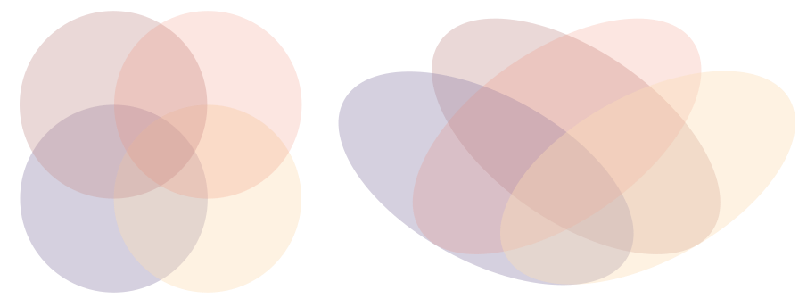

[//]: # ( TODO add more euler diagram examples: )
[//]: # (   maybe this? https://www.reddit.com/r/dataisbeautiful/comments/8ld4ht/venndiagram_comparison_of_biggest_religious )
[//]: # (   find example of non-intersecting euler diagram like this:  https://visual.ly/community/infographic/humor/how-would-you-your-graphic-design )
[//]: # (   find example of proportional ven diagram, where size of circles means sets size)
[//]: # (   find example of venn diagrmans in grid/small-multiple, possibly genetic data)

shows all possible logical relationships between one or more sets. The sets appear as simple shapes, usually circles or rectangles. Each area of overlap is labeled.  Unlike the Venn diagram, the Euler diagram shows not all but only relevant relationships.

<!--more-->
There are two types of Venn diagrams: 
1. *Quantitative* - representing numbers. These diagrams typically do not scale the circle proportionally to the number they represent, but the numbers are written inside the circles and their intersections[^harris]. 
If the shapes are proportional to their values, the diagram is limited to 4 sets since it is impossible to create symmetric Venn diagrams with more than four proportional sets. 
2. *Qualitative* - representing categories. The intersections of sets form a subset that is a new category.

In theory, Venn diagrams work for any number of sets, but the layout becomes increasingly difficult to both build and read beyond just four sets. [^heberle] 

Certain shapes are unusable for Venn diagrams of more than three sets. For three sets, it is possible to use circles.  For four and five sets, it is not possible to use circles such that each one intersects each of the others separately. Ellipses have to be used for four-and five-set Venn diagram.  

The illustration below shows why circles are not possible in a four-set  Venn diagram. The red and blue circles do not overlap uniquely; the same is true for the yellow and brown.

For more than five sets, ellipses become unsuitable, but rectangles and triangles can be used.

[//]: # ( TODO: Add complexity section with illustrations for 2-sets venn, 3 sets venn, 4 sets venn, 5 sets venn, etc )

The Venn diagram appeared in 1880, created by John Venn. He did not call it "Venn diagram" but "Eulerian circles." Euler diagrams are similar to Venn diagrams because both use shapes to represent sets, but Venn diagrams are more restrictive. They require labeling all the possible intersections.

[//]: # ( TODO: Add sections with basic operations on sets: Unions, Intersections, relative complement, Absolute complement, symmetric difference. Add illustration for each interaction, from Wikipedia )

## Further reading
- [Venn diagram](https://en.wikipedia.org/wiki/Venn_diagram) article on Wikipedia.

## References
[^harris]: Harris, Robert L. [*Information graphics: A comprehensive illustrated reference.*](https://books.google.com/books?id=LT1RXREvkGIC) Oxford University Press, 2000, p. 961. Harris explains the differences between the quantitative and qualitative Venn diagrams.
[^heberle]: Heberle, Henry, et al. ["InteractiVenn: a web-based tool for the analysis of sets through Venn diagrams."](https://doi.org/10.1186/s12859-015-0611-3) *BMC bioinformatics* 16.1 (2015): 169. Heberly discusses Venn diagrams of 4 and more sets. [PDF](https://bmcbioinformatics.biomedcentral.com/track/pdf/10.1186/s12859-015-0611-3)

