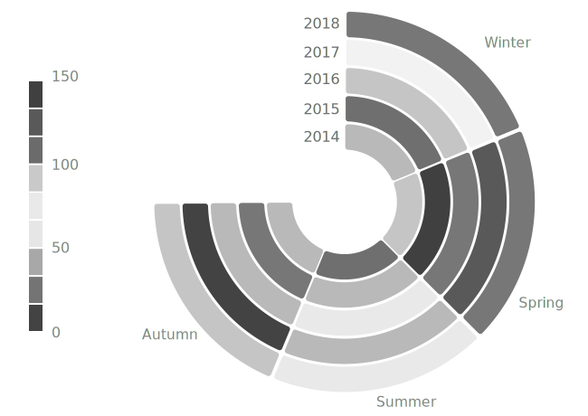
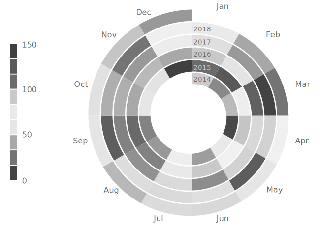
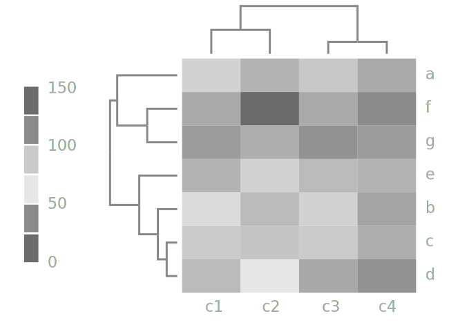

is a table in which values of each cell are represented with a color. 
<!--more-->
The ***rows*** and ***columns*** in a heat map represent either numeric values or categories. Each ***cell*** is filled with a color from the ***color value scale***. A color either corresponds to a single value or to a range of values where the data is grouped.

Functionally, heatmaps are best at revealing the lowest and highest values as well as general patterns. 

The advantage of using heatmaps is that encoding quantitative data with color requires a very small area which allows for a data-dense display within a small space. [^munzer]

As with all information graphics that use color to represent data, the choice of the color scheme is important in a heatmap. The designer can choose between greyscale and color. 

In general, the human eye can differentiate chromatic colors easier than shades of gray. Still, even with chromatic color schemes, an obvious ordering of colors perceived the same way universally does not exist. [^ware] For example, in the context of temperatures, red is perceived as being hotter than orange, but purple may or may not be perceived as hotter than red.
 
Another issue with colors is their influence on each other - adjacent cells of different colors can produce the perception of a gradient even when it is not there.
 
Despite its name, a heatmap normally does not refer to a type of map but a table with color-coded values. Maps that use color coding with a rainbow pattern are also sometimes called heatmaps. But they are not to be confused with [choropleth maps](/choropleth-map) that use a single color per geographic region to represent data.

Heatmaps originate from shading matrices that were used as far back as 1873. [^wilkinson]

## Variations
Heatmap variations have to do with the orientation and layout of the map. The addition of a [dendrogram](/dendrogram) produces a heatmap that also shows the hierarchy of the values.

### Circular heatmap
 A circular heatmap, also called *radial heat map*, orients the axes along the radius of a circle and its perimeter. This layout is beneficial for displaying cyclical events such as climate visualizations. The disadvantage of this layout is the decreasing size of sectors towards the center of the heatmap. They can become unreadable because of their small size and because of the interactions with neighboring colors.

### Spiral heatmap
 *Spiral heatmap* winds the X-axis along a spiral. This space-saving layout is data-dense, but it comes with the disadvantage of low readability of data labels. The closely packed colored areas can also skew the perception of individual colors. Another problem is the decreasing size of sectors towards the center of the heatmap. 

### Cluster heatmap 
 *Cluster heatmap*, also called *double dendrograms*, [^ncss] is the combination of a heatmap and a [dendrogram](/dendrogram) showing one dendrogram for the matrix rows and one for the columns. The cluster heatmap simultaneously reveals row and column hierarchical cluster structure.

                                                                       
## Sources

[^munzer]: Munzner, Tamara ["Visualization Analysis and Design"](https://books.google.com/books?id=NfkYCwAAQBAJ&pg=PT166&lpg=PT166) CRC Press, 2014, p.136.

[^ware]: Ware, Colin. ["Color sequences for univariate maps: Theory, experiments and principles."](https://ccom.unh.edu/sites/default/files/publications/Ware_1988_CGA_Color_sequences_univariate_maps.pdf) *IEEE Computer Graphics and Applications* 8.5 (1988): 41-49.

[^wilkinson]: Wilkinson, Leland, and Michael Friendly. "The history of the cluster heat map." *The American Statistician* 63.2 (2009): 179-184. [PDF](https://www.cs.uic.edu/~wilkinson/Publications/heatmap.pdf)

[^ncss]: [NCSS Statistical Sotfware](https://ncss-wpengine.netdna-ssl.com/wp-content/themes/ncss/pdf/Procedures/NCSS/Clustered_Heat_Maps-Double_Dendrograms.pdf) Chapter 450
