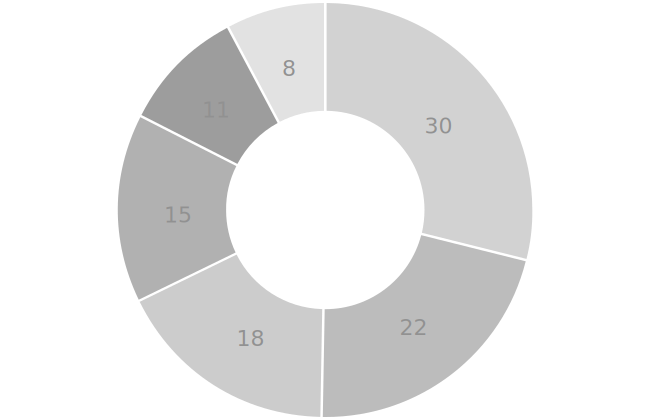
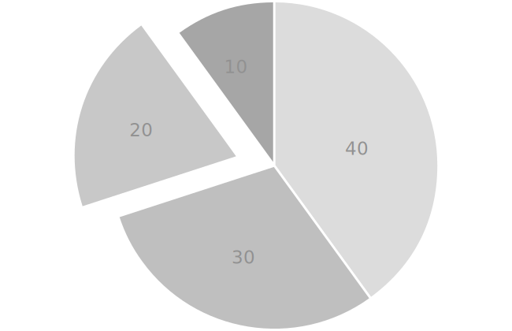
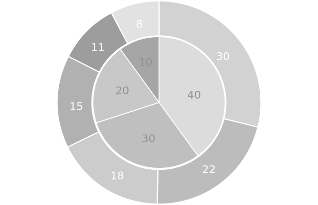

is a type of graph that displays numbers as segments of a circle with the circle representing 100 percent. The wedge-shaped parts represent percentages equal to their arc lengths. 

<!--more-->
The function of a pie chart is the visual illustration of part-to-whole relationships. Pie charts are best used to show values of 25%, 50%, and 75%. The wedges in these cases have right angles, which is easy for the eye to interpret accurately.
 
Values smaller than 10% are difficult for viewers to estimate. Fractions such as 38.5% and unrounded numbers such as 38% are virtually impossible to see on a pie chart.

Pie charts are criticized for their overuse because human perception is not capable of accurately comparing wedge-shaped slices.[^tufte] Charts that use rectangular shapes are thought to be easier to perceive, especially when readers need to see specific values.

Pie charts should not be used to represent sums of parts where the sum is not meaningful to the reader. For example, showing the total number of goals across several soccer teams would not be useful because it makes sense to compare them and not to add. [^good]
 
Pie charts are one of the most widely used types of data visualization likely because of the human predisposition towards circles and radiating patterns.[^lima]

Scottish engineer William Playfair is the creator of the first pie chart published in *Statistical Breviary* in 1801.  [^spence]

## Variations
Many stylistic variations of the pie chart exist. Since the exact sizes of segments are difficult for the human eye to compare, techniques such as exploding the pie chart separate the segments for easier comparison. However, there is evidence that distorting the basic pie chart only makes it more unreadable. [^kosara]

### Doughnut chart
 Doughnut chart or *donut chart* is a pie chart with the center cut out. Doughnut charts are used to reduce the amount of ink on a page, especially when showing many pie charts side by side.

### Exploded pie chart
 Exploded pie chart is a stylistic variation of a pie chart with one, or several of the wedges shifted equally outward from the center. The intended effect is the emphasis of the size of the "exploded" wedge. However, this technique may be counter-productive since standalone wedges are not easier to compare visually with the rest of the circle.

### Stacked pie chart
 Stacked pie chart or *nested pie chart* is a group of pie charts that are positioned concentrically. This variation is practical using two to four nested charts. If more charts are added, the inner ones become too small to read.

## Alternatives
1. [*Stacked Bar Chart*](/bar-chart) a pie chart is essentially a stacked bar chart with a single bar shown in polar coordinates.[^wilkinson2] Functionally absolutely the same, but the bar chart rectangles give readers a more natural way of judging the areas.
2. [*Polar area chart*](/polar-area-chart) is a type of pie chart in which all sectors have equal angles, but they differ in how far each segment extends from the center of the circle. The polar area chart is used to plot cyclic phenomena, for example, the amount of rain each month appears as 12 sectors at 30 degrees each.
3. *Waffle chart* shows ratios using a grid of squares representing one hundred percent and coloring the part representing a fraction of the whole.
## Sources
[^tufte]: [Tufte, Edward. The Visual Display of Quantitative Information. Graphics Press, 2001](https://cyber.rms.moe/books/03%20-%20General%20Science/The%20Visual%20Display%20of%20Quantitative%20Information%20-%20Edward%20Tufte.pdf)
[^good]: Good P.I., Hardin J.W. Common errors in statistics, and how to avoid them (Wiley, 2003). p.117
[^wilkinson]: [Wilkinson, L., 2005. The Grammar of Graphics, Second Edition. Springer. pp.251-252](https://www.cs.uic.edu/~wilkinson/TheGrammarOfGraphics/GOG.html)
[^wilkinson2]:[Wilkinson, L., 2005. The Grammar of Graphics, Second Edition. Springer. p. 23](https://www.cs.uic.edu/~wilkinson/TheGrammarOfGraphics/GOG.html)
[^lima]: [Lima, Manuel. "Why humans love pie charts: a historical and evolutionary perspective," Noteworthy, retrieved May 10, 2019](https://blog.usejournal.com/why-humans-love-pie-charts-9cd346000bdc)
[^kosara]: [Kosara, Robert, and Skau.Drew,  2016. Judgment error in pie chart variations. In Proceedings of the Eurographics / IEEE VGTC Conference on Visualization: Short Papers (EuroVis '16). Eurographics Association, Goslar Germany, Germany, 91-95.](https://kosara.net/papers/2016/Kosara-EuroVis-2016.pdf)
[^spence]:[Spence, Ian. No Humble Pie: The Origins and Usage of a Statistical Chart Journal of Educational and Behavioral Statistics In: Winter 2005, Vol. 30, No. 4, p. 360](http://www.psych.utoronto.ca/users/spence/Spence%202005.pdf)
