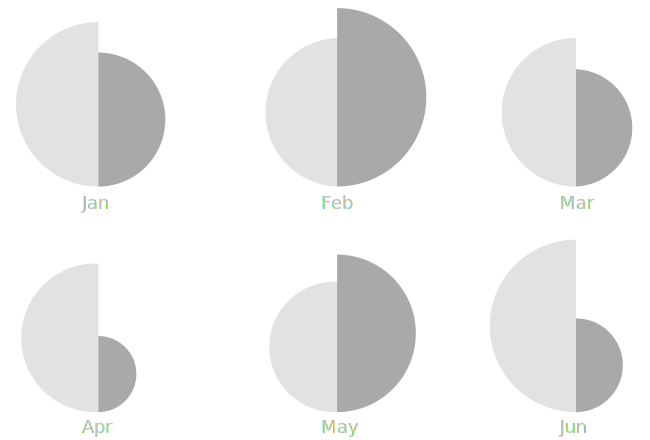
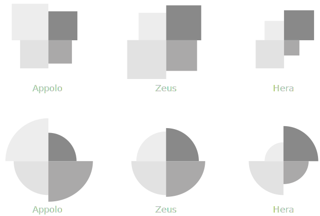
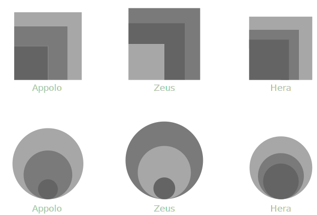
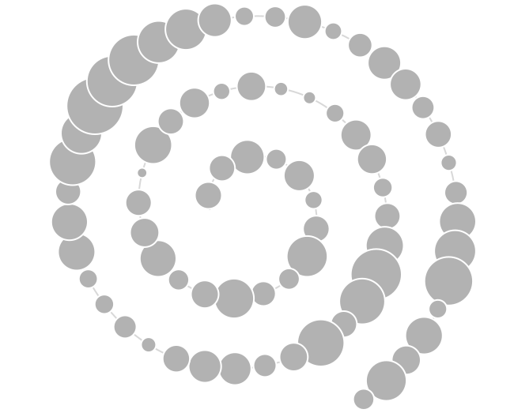
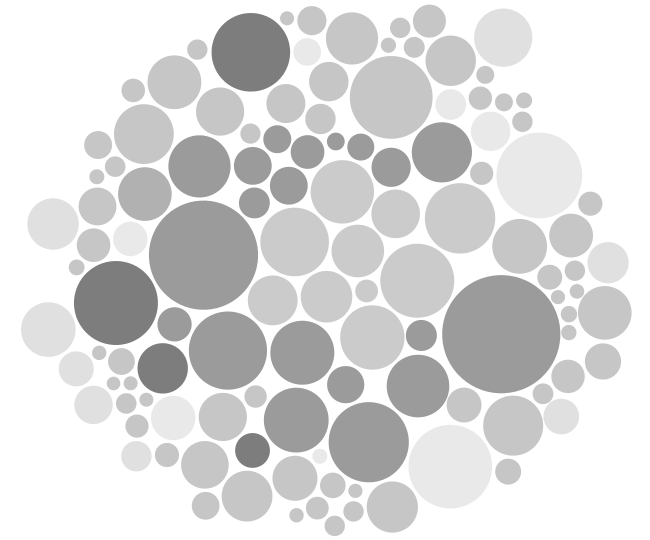

is a type of one-dimensional chart that uses area of a shape to visualize a single variable without the use of axes. A shape, usually a rectangle, is scaled proportionally to the value it represents.

<!--more-->
Proportional area charts communicate a single variable through the area of a figure. Rectangles are the most common shape because estimating their areas is more intuitive for the human eye than areas of circles and other polygons.

Shapes typically align along their bottom edges, which enables the reader to compare their heights. The amount typically appears next to the shape. The chart is typically ordered in decreasing order of magnitude.

The chart uses no axes.[^harris] The shapes appear in a line or a grid. The absence of axes makes it possible to use this chart as [small multiples](/small-multiples).

With circular shapes, the area, not the radius, is used. 

Pictographs and illustrations are not the best choices of shape for a proportional area chart since the areas of such complex shapes are not possible to compare effectively.

## Variations

### Split proportional area chart
 uses halves of two circles, the area of which can be inferred from the half. This variation encourages a more precise comparison of the two shapes.

### Quadruple proportional area chart
 Similar to a split proportional chart, the quadruple proportional chart locates a group of shapes in close proximity to each other to enable the reader to compare their areas.

### Nested proportional area chart
 Nested proportional area charts overlap the shapes to facilitate comparison between them. The nested shapes are typically aligned either at their bottom edge or in the lower left corner. The nesting tends to negatively impact the chart's readability. At the same time, the chart becomes more compact. Although it is difficult to extract precise values from this chart for a reader, when accompanied by values written out next to shapes, this chart variation can be useful. A common use case is the legend of a bubble chart or a [proportional symbol map](/bubble-map). 

### Spiral proportional area chart
 Shapes in a proportional area chart can be arranged in a spiral as a space-saving technique. Partial overlap of shapes is possible when circles are used since their area can be inferred even when partially hidden.

### Proportional area chart with circle packing
 Shapes can be arranged in a space-saving layout such that they are located closest to each other while avoiding overlapping, called circle packing. 

## Sources
[^harris]: Harris, Robert L. [*Information graphics: A comprehensive illustrated reference.*](https://books.google.com/books?id=LT1RXREvkGIC) Oxford University Press, 2000, p.680-81.
