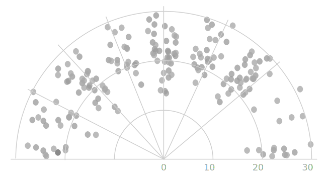
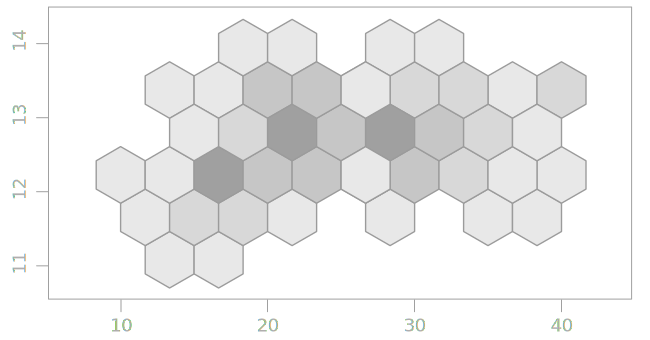
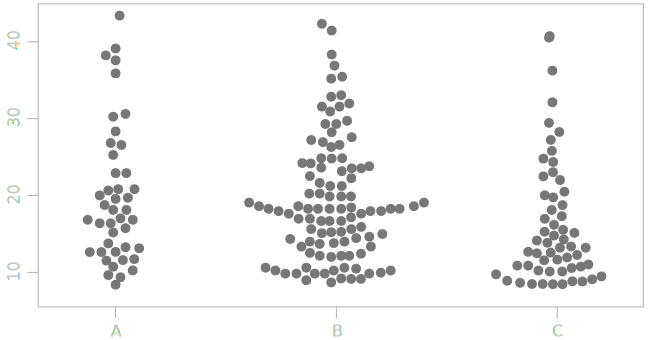

is a visualization method for showing distribution of two variables along the horizontal and vertical axes. Scatter plots are used to show correlation and detect outliers. [^friendly]

<!--more-->
The scatter plot first appeared in the work of English statistician Francis Galton who is also the creator of the concept of correlation in statistics.

 Scatter plots are used to show correlation between two variables because they show exactly how individual data points are distributed. The independent variable is usually plotted on the X axis, and the dependent of the Y axis.  A trendline, also called the line of best fit, can be drawn in order to emphasize the outliers and identify trends. 
 
 Scatter plots are common in scientific publications, making up to 80% of all charts.[^tufte]
 
 Since scatter plots display a dot for every data point, overplotting is a common problem. [^carr] The existing solutions include representations of densities, not individual data points, using greyscale or using a symbol, often a hexagon. An example of such a density distribution scatter plot is a hexagonal bin plot.

## Variations

### Radial Scatter plot
 Radial scatter plot is functionally the same but set into polar coordinates. This variety of scatter plot is useful for visualizing cyclical or seasonal phenomena. One example below shows the incidence of disease by birth month.

### Hexagonal bin plot
 Hexagonal bin plot is a scatter plot where individual observations were put into bins as then each bin represented as a symbol colored to show the density.

### Beeswarm plot
 Beeswarm plot is a one-dimensional scatter plot like "stripchart", but with closely-packed, non-overlapping points.
<!-- @anna rewrite this, copy-paste -->

## Sources
[^friendly]: [Friendly, Michael and Daniel J. Denis. “The early origins and development of the scatterplot.” Journal of the history of the behavioral sciences 41 2 (2005): 103-30 .](http://datavis.ca/papers/friendly-scat.pdf)
[^tufte]: Tufte, E. R. (1983). The visual display of quantitative information. Cheshire, CT: Graphics Press.
[^carr]: [Carr, D., Littlefield, R., Nicholson, W., & Littlefield, J. (1987). Scatterplot Matrix Techniques for Large N. Journal of the American Statistical Association, 82(398), 424-436. doi:10.2307/2289444](https://www.jstor.org/stable/2289444)

