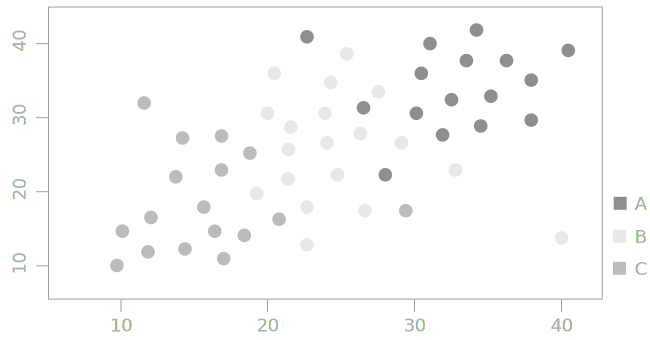
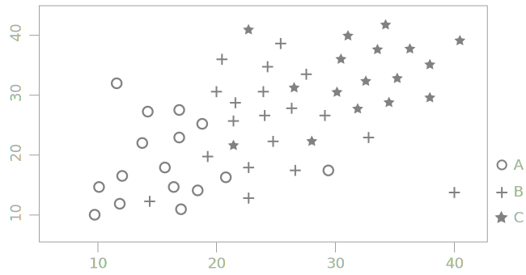

is a visualization method for showing the distribution of two variables along the horizontal and vertical axes. Scatter plots are used to show correlation and detect outliers. [^friendly]

<!--more-->
The scatter plot first appeared in the work of English statistician Francis Galton, who also created the concept of correlation in statistics.

Scatter plots are used to show a correlation between two variables because they show the exact distribution of all individual data points. To display a correlation, a graph must have one independent variable and one dependent variable. The independent variable usually appears on the X-axis and the dependent on the Y-axis.  A trendline also called the *line of best fit* can be drawn to emphasize the outliers and identify trends. 
 
Scatter plots are common in scientific publications, making up to 80% of all charts.[^tufte]
 
Since scatter plots display a dot for every data point, overplotting is a common problem. [^carr] The existing solutions include representations of densities, not individual data points, using greyscale or using a symbol, often a hexagon. An example of such a density distribution scatter plot is a hexagonal bin plot.

[//]: # (Todo: Add 3 types of correlation types: direction, form, and strength https://www.westga.edu/academics/research/vrc/assets/docs/scatterplots_and_correlation_notes.pdf)

## Variations

### Multi-color scatter plot
 Color can be used to show different data series in one scatter plot. Color can also be used to encode one additional categorical variable. 

### Multi-symbol scatter plot
 Symbols can be used in a scatter plot to encode one additional categorical variable. Symbols can replace color variation in cases where only monochromatic color scheme is available.

### Radial scatter plot
 Radial scatter plot is functionally the same except that it is set into polar coordinates. This variety of scatter plot is useful for visualizing cyclical or seasonal phenomena. One example below shows the incidence of disease by birth month.

### Hexagonal bin plot
 Hexagonal bin plot is a scatter plot where individual observations were put into bins. Binning is a process of grouping observations at a set interval, which is the bin size. Each bin is represented as a symbol colored to show the density it represents. Sexagons are often the symbol of choice because of their tiling properties. 

## Sources
[^friendly]: Friendly, Michael, and Daniel Denis. ["The early origins and development of the scatterplot."](https://doi.org/10.1002/jhbs.20078) *Journal of the History of the Behavioral Sciences* 41.2 (2005): 103-130. [PDF](http://datavis.ca/papers/friendly-scat.pdf)
[^tufte]: Tufte, Edward R. [*The visual display of quantitative information.*](https://www.edwardtufte.com/tufte/books_vdqi) Vol. 2. Cheshire, CT: Graphics press, 2001.
[^carr]: Carr, Daniel B., et al. ["Scatterplot matrix techniques for large N."](https://www.jstor.org/stable/2289444) *Journal of the American Statistical Association* 82.398 (1987): 424-436.

