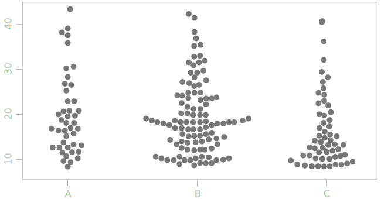

is a type of chart  ...

[//]: # ([need researh] Alberto Cairo is a pioneer of strip plot. https://twitter.com/albertocairo/status/1067393850338086917?lang=en
He also calls it "Jitter plot")

<!--more-->

https://www.doingdata.org/blog/how-to-create-jitter-plot-strip-plot-in-tableau

## Variations

### Beeswarm plot
 Beeswarm plot is a one-dimensional scatter plot like "stripchart", but with closely-packed, non-overlapping points.
<!-- @anna rewrite this, copy-paste -->
