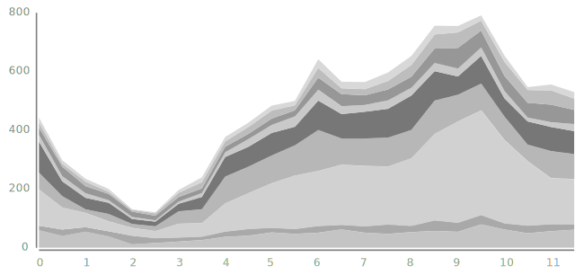
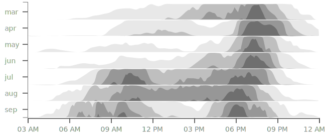
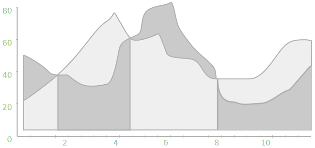
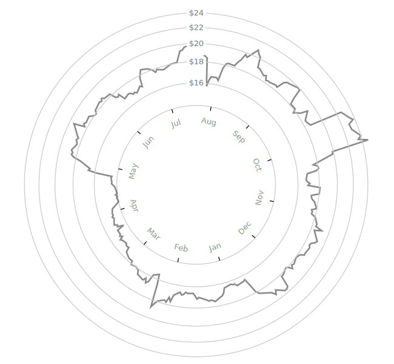
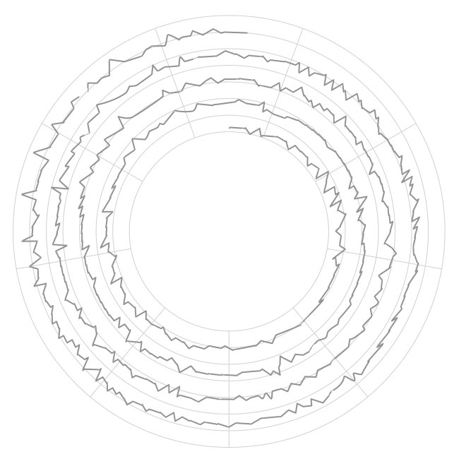
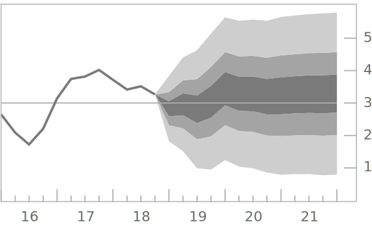

is a type of [line chart](/line-chart) that shows discrete data points in chronological order connected with line. 

<!--more-->
A time-series graph is drawn on the horizontal and vertical axes. The time appears on the horizontal axis. Typically, the time is plotted at equal intervals unless the chart covers a very long period, in which case a logarithmic scale is more useful. [^harris]The X-axis represents time. Time units can cover minutes, hours, days, weeks, and years. The Y-axis represents a quantitative value. The vertical axis can display percentages, ratios, duration, and repetition.

Depending on the underlying data, a time series can be *continuous* or *discrete*. A time series is continuous when observations are recorded and plotted without interruptions in time. A time series is discrete when observations are taken at specific points in time, even if they are equally spaced. 

The most common use case of a time-series is displaying equally spaced data points and the line of best fit. 

## Variations
Time series variations involve positioning multiple time series in the same graph space. Another possibility is arranging separate time-series graphs in a grid or a row for comparison.[^javed]

### Stacked time series
 Uses the same graph space to plot multiple time series. The space below each data curve is filled, similar to a [stacked area chart](/area-chart), to help the reader distinguish the often tightly-packed graphs. 

### Horizon chart
  Uses the concept of *virtual resolution* by limiting the graph space using bands that make only part of the graph visible. Horizon charts are useful for comparing time series in a generalized way.

### Braided time series 
 Consists of at least two intersecting time series with the areas under the data curve filled. The areas are sorted in depth order for each position along the time axis. The purpose of the braided time series is helping the reader see multiple color-coded time series. [^javed2]

### Radial time series
  Use polar coordinates instead of the traditional coordinates plotting the time series around a central point. This orientation is useful for visualizing cyclical events such as seasonal weather patterns.

### Spiral time series
 Uses polar coordinates for events that following a repeating pattern but are not necessarily cyclical. The spiral is a space-saving layout that allows for more data-dense visualization.

###  Fan chart (time series)
 Combines a standard line chart based on past data with a range of projections of future data values. The center of the fan pattern represents the most likely outcomes with the outer edges of the fan pattern showing the higher and lowest estimates.

## Sources
[^harris]: Robert L. Harris. 1999. [Information Graphics: A Comprehensive Illustrated Reference.](https://books.google.com/books?id=LT1RXREvkGIC&printsec=frontcover&source=gbs_ViewAPI&redir_esc=y#v=onepage&q&f=false) Oxford University Press, Inc., New York, NY, USA. p. 920
[^javed]: [Javed, W., McDonnel, B., and Elmqvist, N. Graphical Perception of Multiple Time Series. IEEE Transactions on Visualization and Computer Graphics (2010). doi: 10.1109/TVCG.2010.162](https://engineering.purdue.edu/~elm/projects/multilinevis/multilinevis.pdf)
[^javed2]: [Javed, W., 2010, p. 927,](https://engineering.purdue.edu/~elm/projects/multilinevis/multilinevis.pdf)
