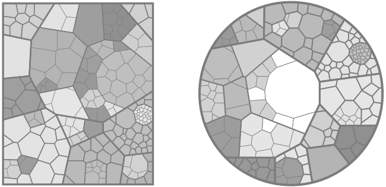
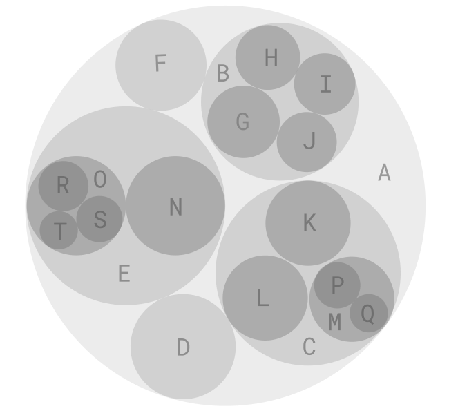
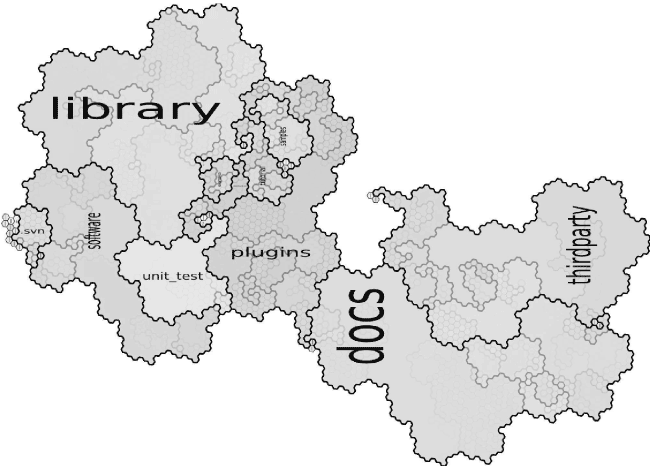

is a type of chart that displays hierarchical data using nested figures, usually rectangles, proportional in area to the data they represent. 

<!--more-->
Each *parent node* in a treemap appears as a larger rectangle that contains a smaller rectangle that is its *child node*. This recursive construction allows the treemap to visualize hierarchical data with any number of levels.

Any treemap can be redrawn as a [tree diagram](/tree-diagram) because they are structurally equivalent. However, the treemap fills the space more economically allowing for a higher density of data in a compact space.

The treemap was invented by professor Ben Shneiderman in the early 1990s as a way of visualizing disk space usage. He explained that "Tree-structured node-link diagrams grew too large to be useful, so I explored ways to show a tree in a space-constrained layout." [^schneiderman]

Rectangle-based treemaps, the most typical kind,  suffer from legibility problems because the rectangles become too long and too short while they are fitted into a larger rectangle along with others. This is known as a "slice-and-dice" method. Ideally, rectangles should have an aspect ratio close to 1, meaning almost a square. [^wattenberg] Compact rectangles allow readers to estimate their area more accurately and in interactive data visualizations to select them more easily. Algorithms involving *squarification*[^bruls], or the process of cutting and rearranging a rectangle into a more compact rectangle, can produce more functional treemaps.

Another solution is using other figures such as polygons as in Voronoi treemap or circles as in circle treemap. However, even in uncomplicated data visualizations, readers can judge the areas of rectangles more effectively than areas of polygons and especially circles. [^kong]

## Variations

### Voronoi Treemap
 Voronoi treemaps represent hierarchical data by recursively partitioning polygons using weighted centroidal Voronoi diagrams. The polygon areas represent data the same way as rectangle-based treemaps.
<!-- @anna Maybe add that voronoi treemap could be 'packed' into different shapes square/rect, circle/ellipse, triangle, pentagon, etc. -->

### Circle Treemap
 Also called *circle packing*, the circle treemap is the same as the rectangle-based treemap functionally except its readability. The human eye can estimate the areas of rectangles much more accurately than of circles. That is why circle treemaps are useful only for showing a general idea of how the parts of a treemap relate.

###Jigsaw Treemap
 The jigsaw treemap cuts rectangles of a treemap into equally-sized squares and then reassembles them into jigsaw-resembling shapes that are fitted without gaps. This layout allows every leaf node to be roughly square and therefore, legible and selectable. [^wattenberg] The tradeoff is the unfamiliar shapes that readers cannot easily evaluate, either for the area or for tree topology.
<!-- @anna is Gosper type of Jigsaw treemaps or same thing? -->

### Gosper Maps
Gosper maps are based on fractal geometry - shapes that are self-similar and when repeated form a pattern that looks like the basic shape itself. The map resembles a cartographic map with a visible nested structure. [^auber]

## Alternative charts
1. [*Marimekko chart*](/marimekko-chart) uses the area of rectangles positioned along the X and Y axes to represent three variables. Unlike the treemap, it cannot reflect hierarchies.
2. [*Tree diagram*](/tree-diagram) uses nodes and links to show a hierarchical structure.

## Sources
[^schneiderman]: Shneiderman, Ben. ["Treemaps for space-constrained visualization of hierarchies."](http://www.cs.umd.edu/hcil/treemap-history/index.shtml) (2005).
[^kong]: N. Kong, J. Heer and M. Agrawala, ["Perceptual Guidelines for Creating Rectangular Treemaps"](https://ieeexplore.ieee.org/document/5613436) in IEEE Transactions on Visualization and Computer Graphics, vol. 16, no. 6, pp. 990-998, Nov.-Dec. 2010. doi: 10.1109/TVCG.2010.186s
[^wattenberg]: Wattenberg, Martin. ["A note on space-filling visualizations and space-filling curves." IEEE Symposium on Information Visualization, 2005. InfoVis 2005. IEEE ](http://hint.fm/papers/158-wattenberg-final3.pdf) (2005). 
[^bruls]: Bruls, Mark, Kees Huizing, and Jarke J. Van Wijk. ["Squarified treemaps."](https://www.win.tue.nl/~vanwijk/stm.pdf) Data Visualization, 2000. Springer, Vienna, 2000. 33-42.
[^auber]: Auber, David, et al. ["Gospermap: Using a gosper curve for laying out hierarchical data."](https://hal.archives-ouvertes.fr/hal-00959383/document) IEEE Transactions on Visualization and Computer Graphics 19.11 (2013): 1820-1832.
