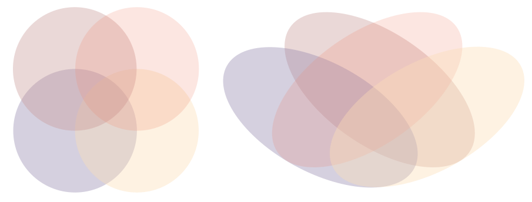

shows all possible logical relationships between one or more sets. The sets are represented as simple shapes, usually circles or rectangles. Each area of overlap is labeled.  Unlike the Venn diagram, the [Euler diagram](/euler-diagram) shows not all but only relevant relationships.

<!--more-->
There are two types of Venn diagrams: 
1. Quantitative - representing numbers. These diagrams do not scale the circle proportionally to the number they represent but the numbers are written on the circles and their intersections[^harris]. If the shapes are proportional, the diagram is limited to 4 shapes since it is not possible to create symmetric Venn diagrams with more than four sets that are are -proportional. 
2. Qualitative - representing categories.

Venn diagrams may be built for any number of sets, however, the layout becomes increasingly difficult to both build and read beyond four sets. [^heberle]

For 3 sets, we can use circles. 

For 4 and 5 sets, we cannot use circles such that all of them intersect uniquely - we have to use *ellipses*. In the illustration below, the red and blue circles do not overlap uniquely. The same is true for the yellow and brown.

For more than 5 sets, we cannot use ellipses but other shapes, such as squares and triangles can be used.

The Venn diagram was invented in 1880 by John Venn. He did not call them "Venn diagrams" but "Eulerian circles". Euler diagrams are similar to Venn diagrams because they also use shapes to represent sets, but Euler diagrams are less restrictive since they do not require showing all the possible relationships.

## Sources
[^harris]: Harris explains the the differences between the quantitative and qualitative Venn diagrams, see *Robert L. Harris. 1999. [Information Graphics: A Comprehensive Illustrated Reference.]((https://books.google.com/books?id=LT1RXREvkGIC&printsec=frontcover)) Oxford University Press, Inc., New York, NY, USA. p. 961*
[^heberle]: Discussion of Venn diagrams of 4 and more sets *Heberle, Henry & Meirelles, Gabriela & da Silva, Felipe & P Telles, Guilherme & Minghim, Rosane. (2015). [InteractiVenn: A web-based tool for the analysis of sets through Venn diagrams.](https://bmcbioinformatics.biomedcentral.com/articles/10.1186/s12859-015-0611-3) BMC Bioinformatics. 16.*

