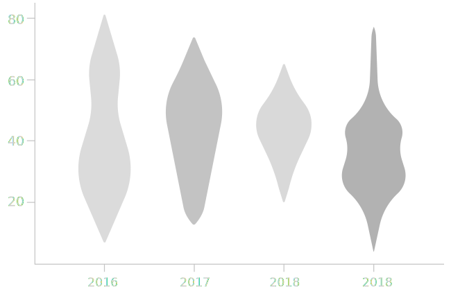
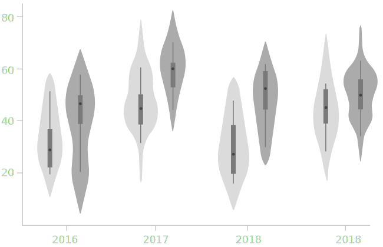
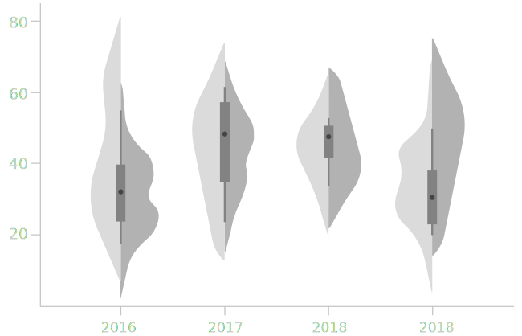

is a combination of a [box plot](/box-plot) and a kernel [density plot](/density-plot) added on both sides. Similar to a box plot, a violin plot shows four types of values. The outer shape represents all possible results with the thickest section representing the mode average.

<!--more-->
The violin plot aims to solve the problem of over-generalization in a box plot by showing how the values are distributed using the density plot. In data sets with *multimodal distributions*, those with multiple peaks, box plots would not reveal them.  Violin plots offer the advantage of comparing both the distributions and the medians across categories. 

Violin plot anatomy is similar to the box plot. The media is the white dot in the middle. The thick bar along the center shows the interquartile range, which is the two middle quartiles. The thin line in the center is the 95% confidence interval, which is the rest of the distribution except the outliers. 

The distribution of all the data points is shown symmetrically as density plots on both sides. The thicker parts mean a higher probability that a data point falls in that range, and thinner sections show a lower probability.

The violins in the chart typically have an ordering, often by the median.

## Variations

### Boxless Violin plot
 Is a violin plot without box 

[//]: # (TODO: explain what is the reason to show it without a box)

### Grouped violin plot
 A grouped violin plot displays two violins per category each representing a sub-category, for example, male and female.

### Split violin plot
 A split violin plot shows two different groups of data on the left and right side of its central axis. In data sets with two categories, for example, male and female, the split violin allows for a compact comparison.

[//]: # (Maybe add Raincloud plot, a combination of a 'split-half violin', raw jittered data points, and a standard visualization of central tendency and error, such as a boxplot.)
[//]: # (TODO: Here is a paper https://peerj.com/preprints/27137v1 )

## Combinations
In principle any chart that shows [distribution](/function/distribution) can replace half of violing plot or compliment it (beeswarm plot, histogram, jitter plot, barcode chart, etc).

[//]: # (TODO: add combinations illustrations for violin plot with beeswarm plot, violin plot with histogram, violin plot with barcode chart)
[//]: # (Combination of violin and jitter plot https://twitter.com/lenkiefer/status/805186350760755200/photo/1 )

## Sources
[^hintze]: The violin plot first appeared in this paper by Hintze, Jerry & Nelson, Ray. (1998). [Violin Plots: A Box Plot-Density Trace Synergism.](https://search.proquest.com/openview/dcd68eb137d2d6b08aa23f37e34e0b01/1?pq-origsite=gscholar) American Statistician - AMER STATIST. 52. 181-184. 10.1080/00031305.1998.10480559. 
